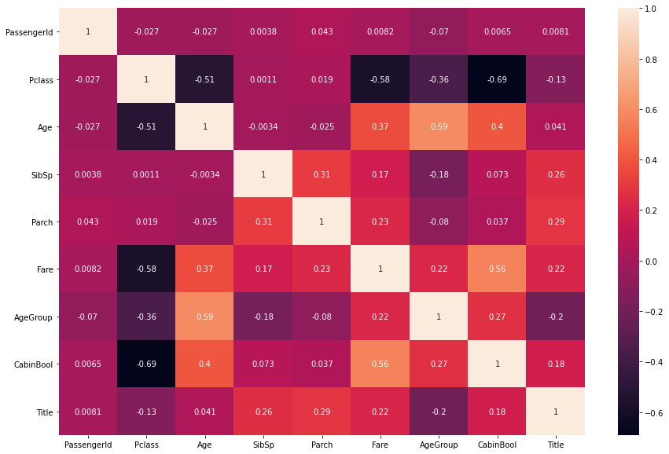

# Titanic-Passenger-Survival-Analysis

### Here is a quick explanation of some of the features:
1. Survived: that's the target, 0 means the passenger did not survive, while 1 means he/she survived.
2. Pclass: passenger class.
3. Name, Sex, Age: self-explanatory
4. SibSp: how many siblings & spouses of the passenger aboard the Titanic.
5. Parch: how many children & parents of the passenger aboard the Titanic.
6. Ticket: ticket id Fare: price paid (in pounds)
7. Cabin: passenger's cabin number
8. Embarked: where the passenger embarked the Titanic
##### What are the data types for each feature?
- Survived: int
- Pclass: int
- Name: string
- Sex: string
- Age: float
- SibSp: int
- Parch: int
- Ticket: string
- Fare: float
- Cabin: string
- Embarked: string
## Final Feature of Titanic Passenger Survival

### Summary of Titanic Passenger Survival Data
I will be testing the following models with my training data :
- Gaussian Naive Bayes
- Logistic Regression
- Support Vector Machines
- Perceptron
- Decision Tree Classifier
- Random Forest Classifier
- KNN or k-Nearest Neighbors
- Stochastic Gradient Descent

Gradient Boosting Classifier For each model, we set the model, fit it with 80% of our training data, predict for 20% of the training data and check the accuracy.
